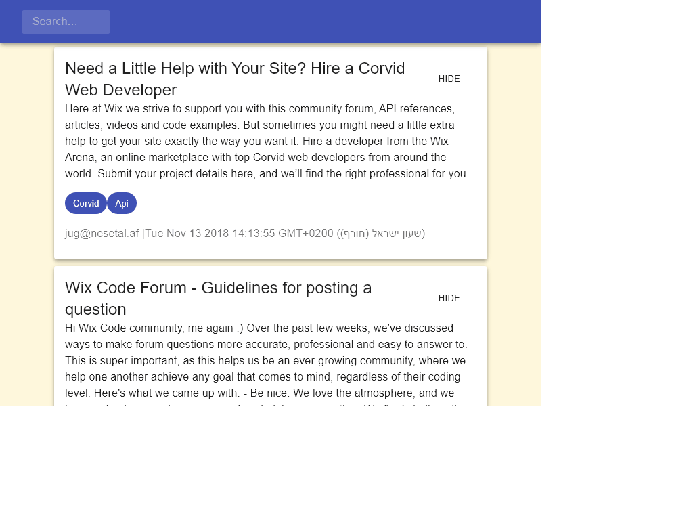

#    Final 1/5 - Tickets Manager
This project will include most of the topics we have learnt so far.
This repository includes a basic skeleton with automated tests, use it for you submissions.
In this project you will create a Ticket Manager Web Application, with React.js and Express

## Instructions
1. [Import](https://github.com/new/import) this repository into your account. Make sure to select the private option
1. Clone your new repository to your computer
1. Install the project dependencies by running `npm install` from the client folder *and* the server folder
1. Create new brunch for your all work (both frontend and backend)
1. Change the project to meet the requirements, commit only to your work branch.
1. [Commit Early, Push Often](https://www.worklytics.co/commit-early-push-often/), your work might be evaluated by your push history
1. Once you are done and want to submit, follow the [Submitting](#Submitting) section
1. Good Luck!

## Running tests
We have created automated tests for your convenience, use it to check your progression.

Note that the automated tests rely on your code having the exact class names and Ids as specified below.
We encourage you to add your own tests.

* To run the *server tests* simply run `npm run test` on server folder
* To run the *client tests* make sure you started the development server on  port 3000 (via the `npm start` script) and then run `npm run test` from client folder

## Backend Requirements
The Express app should be located in the path `server/app.js` and export the `app` object (`module.exports = app;`).
- The server should run on port `8080` serve the react app on `http://localhost:8080/` and expose those API endpoints:
  - [GET] api/tickets - returns an array of tickets from saved in `server/data.json`. If called with [query param](https://en.wikipedia.org/wiki/Query_string) `searchText` the API will [filter](https://developer.mozilla.org/en-US/docs/Web/JavaScript/Reference/Global_Objects/Array/filter) only tickets that have a title including a [case-insensitive](https://en.wikipedia.org/wiki/Case_sensitivity) version of the `searchText` param
  - [POST] api/tickets/[:ticketId](https://stackoverflow.com/a/20089634/10839175)/done - Sets `done` property to `true` for the given ticketId
  - [POST] api/tickets/[:ticketId](https://stackoverflow.com/a/20089634/10839175)/undone - Sets `done` property to `false` for the given ticketId

## Requirements Client
- The app title should be `Tickets Manager` with a custom [favicon](https://en.wikipedia.org/wiki/Favicon). You can create one [here](https://favicon.io/)
- The app should load (from backend) and show all Tickets.
- The Ticket component should have className `ticket` and should match this appearance: 

- App ticket data (received from the server) might contain `label` property (an array of strings). add those tags to the UI using elements having the `lable` class. Use the following style as an example: 

PS: feel free to add more label strings to the data (`data.json`) if you need.
- The app should have input with id `searchInput`. This input should request the server on `onChange` with relevant `searchText` param and update the list accordingly
- Add a hide button with className `hideTicketButton` that will hide the tickets from view. Add a counter of number of hiding tickets, this counter should have a `hideTicketsCounter` className.
- Add a button to restore the hidden ticket list on click with the id `restoreHideTickets` 

## Before Submitting Requirements
- Use [ESLINT](https://eslint.org/docs/user-guide/getting-started) - run `npx eslint --init` in the backend folder & in the client.
Use a popular style guide - Airbnb

- Deploy your app with [Glitch](https://glitch.com/?utm_medium=weblink&utm_source=dev.to&utm_campaign=blog&utm_content=dev) with [this](https://dev.to/glitch/create-react-app-and-express-together-on-glitch-28gi) tutorial

## Bonus
1. New feature - add any cool functionality you want to the app
2. Testing that feature - add a test to that new feature
3. Add an explanation for this new feature in your PR 

## Submitting
1. Before submitting, create a gif demoing your app in action using the testing framework by running the command: `$env:RECORD_TEST='true'; npm run test` in your client folder, this will create a gif file of your UI testing. Note, this may take up to 4min to complete
1. Open a PR from your work branch to the unchanged main branch (remember to include the generated `ui-testing-recording.gif` file)
1. Invite `Cyber4sPopo` as a [collaborator](https://docs.github.com/en/github/setting-up-and-managing-your-github-user-account/inviting-collaborators-to-a-personal-repository) to your repo 👮
1. Create a Pull Request from the new brunch into master in your duplicated repository

## Grading policy
* Your project will be graded by the number of automatic tests you pass
* Visual creativity, use css to make this app look awesome 💅🏿
* Code quality: Variable naming, meaningful comments, logic separation into functions
* Git usage: commit messages, and overall git usage flow

## My glitch
https://ticket-manger.glitch.me

## My gif
